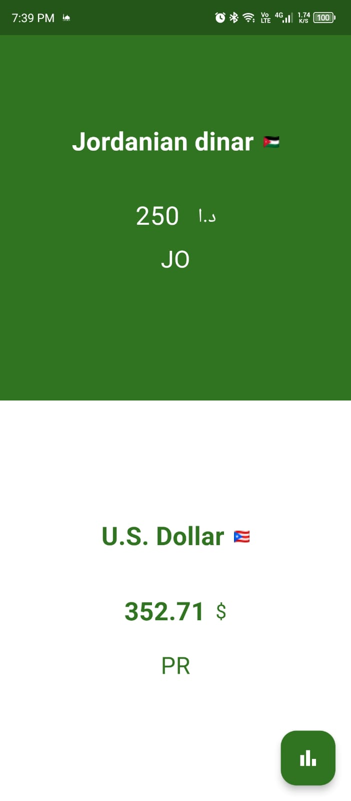
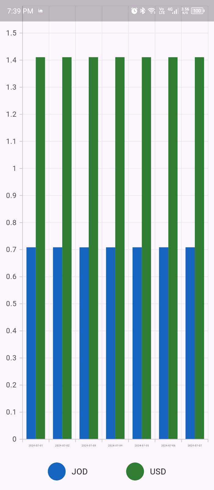
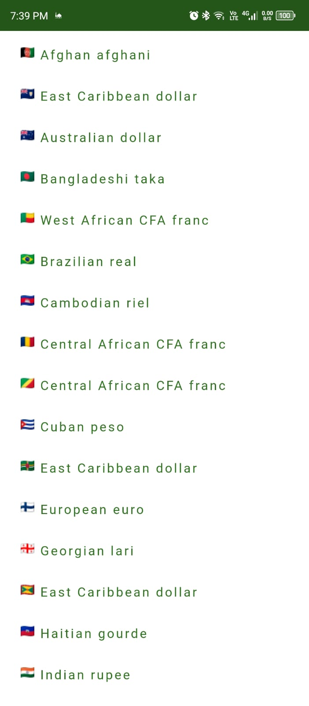
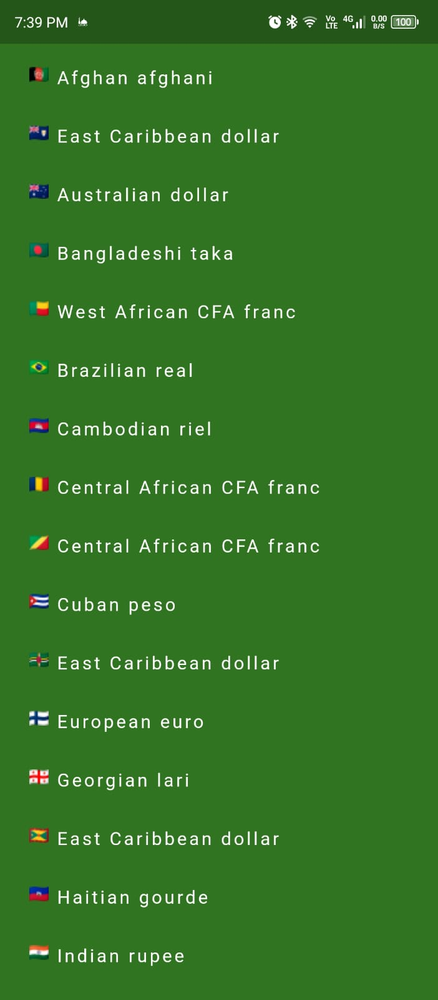

# Currency 

A currency converter flutter app.

# Main Features

- List of supported currencies with their country’s flag. Store the data locally in a database
  after the first API request & load the data from it for future usage.
- Historical data for 2 currencies of your choosing for the last 7 days.
- Currency converter where the user can select 2 currencies with the amount to convert..

API used - https://free.currencyconverterapi.com
flags icons - https://flagcdn.com/

Packeages used -

- [http 1.2.1](https://pub.dev/packages/http)
- [page_transition 2.1.0](https://pub.dev/packages/page_transition)
- [flutter_bloc: ^8.1.6](https://pub.dev/packages/flutter_bloc)
- [get_it: ^7.7.0](https://pub.dev/packages/get_it)
- [syncfusion_flutter_charts: ^26.1.40](https://pub.dev/packages/syncfusion_flutter_charts)
- [intl: ^0.19.0](https://pub.dev/packages/intl)
- [sqflite: ^2.3.3+1](https://pub.dev/packages/sqflite)
- [shared_preferences: ^2.2.3](https://pub.dev/packages/shared_preferences)    
- [flutter_spinkit: ^5.2.1](https://pub.dev/packages/flutter_spinkit)
- [mockito: ^5.0.0](https://pub.dev/packages/mockito)
- [build_runner: ^2.1.2](https://pub.dev/packages/build_runner)
  
  
I have used **flutter_spinkit** and **sqflite** are consider the most popular libraries from flutter both of them have best higher liked and score 

**The state management and the pattern design :** 
**why bloc ??** 
  -Separation of Concerns: By separating the business logic from the UI, the code becomes more organized and easier to manage. 
  -Reusability: BLoC components can be reused across different parts of the application. 
  -Testability: Since the business logic is separated, it can be easily tested without depending on the UI. 
 **why bloc pattern ??** 
  -The BLoC pattern is a powerful approach to managing state in Flutter applications. By separating business logic from the UI, it promotes a cleaner and more maintainable codebase.  
  -Implementing the BLoC pattern involves creating streams and sinks to handle data flow.  
  -making the application more responsive and easy to test. As you build more complex applications.  
  -adopting the BLoC pattern can significantly improve your code's structure and maintainability. 

**pre-build the app :** 
  Set Up Your Development Environment 
    1- Install Flutter SDK 
  Go to the Flutter website. 
  Follow the instructions for your operating system (Windows, macOS, or Linux). 
   2- Set Up the PATH 
      Extract the Flutter SDK to your desired location. 
      Add the Flutter bin directory to your system's PATH environment variable. 
   3- Install an Editor 
      Install an IDE that supports Flutter, such as Visual Studio Code or Android Studio. 
   4- Install Flutter and Dart Plugins  
  For Visual Studio Code: 
   Go to Extensions and install the Flutter and Dart plugins. 
  For Android Studio: 
   Go to Preferences > Plugins and install the Flutter and Dart plugins. 

after the you are ready to open the app and run.

